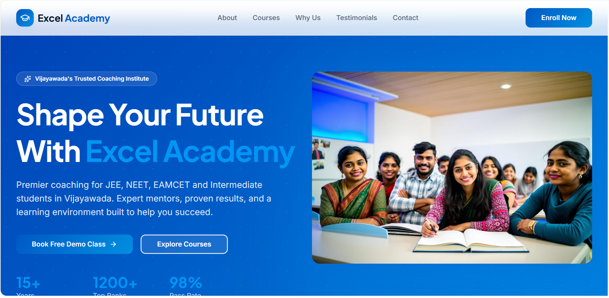
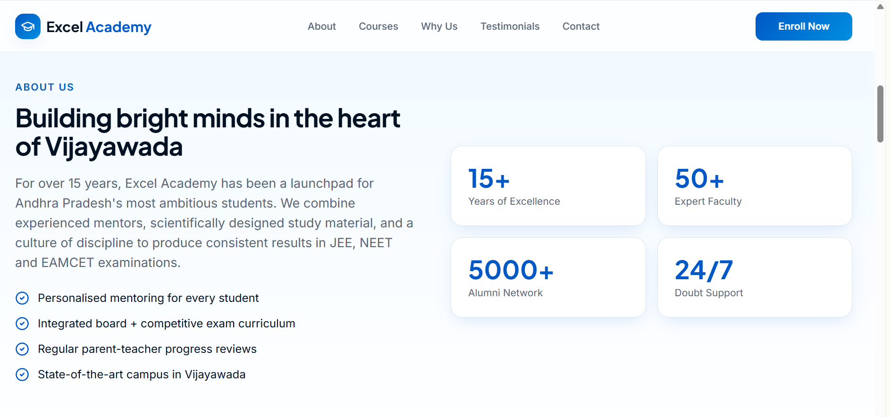
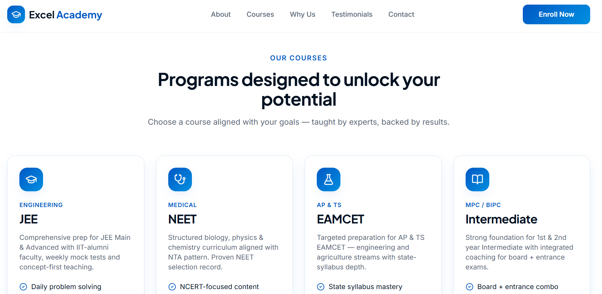

# FUTURE_PE_01

## Project Title

AI Website Copy Generator for Local Businesses

## Business Selected

Excel Academy Coaching Institute

## Tools Used

* ChatGPT
* Lovable
* GitHub

## Objective

Generate professional website content using Prompt Engineering. This project demonstrates how AI can be used to create website-ready content for a local coaching institute through structured and refined prompts.

---

## Prompt Version 1

Create website content for a coaching institute.

---

## Prompt Version 2

Create professional website content for a coaching institute in Vijayawada offering JEE, NEET, EAMCET and Intermediate coaching.

Target students and parents.

Include Homepage, About Us, Courses and Contact sections.

---

## Prompt Version 3

Act as an expert educational website copywriter.

Create persuasive website content for Excel Academy in Vijayawada.

Focus on:

* Student success
* Experienced faculty
* Exam preparation
* Trust building
* Strong CTA

Generate:

* Homepage
* About Us
* Course Descriptions
* Why Choose Us
* Contact CTA

---

## Generated Website Content

### Homepage

Unlock Your Academic Potential with Excel Academy

Expert coaching for Intermediate, JEE, NEET, and EAMCET examinations.

Join Vijayawada's trusted coaching institute and achieve your academic goals with experienced faculty, structured learning, and proven results.

### About Us

Excel Academy is committed to helping students achieve academic excellence through quality education and personalized guidance. Our experienced faculty members focus on conceptual understanding, regular assessments, and exam-oriented preparation.

### Courses

* JEE Coaching
* NEET Coaching
* EAMCET Coaching
* Intermediate Coaching

### Why Choose Us

* Experienced Faculty
* Regular Mock Tests
* Student-Centric Learning
* Proven Academic Results
* Personalized Mentorship

### Contact Us

Ready to start your success journey?

Contact Excel Academy today and take the first step toward achieving your academic goals.

---

## Prompt Engineering Analysis

### Clarity

Added:

* Business name
* Location
* Courses offered
* Target audience
* Required website sections

### Trust

Added:

* Faculty expertise
* Student success focus
* Professional educational tone

### Conversions

Added:

* Enroll Now CTA
* Parent-focused messaging
* Course benefits
* Action-oriented content

---

## Live Website

Website URL:

https://excel-academy-launchpad.lovable.app

---

## Screenshots

### Home Page

### About Us

### Courses

### Contact Section

---

## Learning Outcomes

* Prompt Design
* Prompt Engineering
* AI Website Copywriting
* AI Content Generation
* Content Optimization
* GitHub Repository Management

---

## Conclusion

This project demonstrates how Prompt Engineering can be used to generate professional website content for local businesses. Through prompt refinement, the generated content became more detailed, trustworthy, and suitable for real-world business applications.
